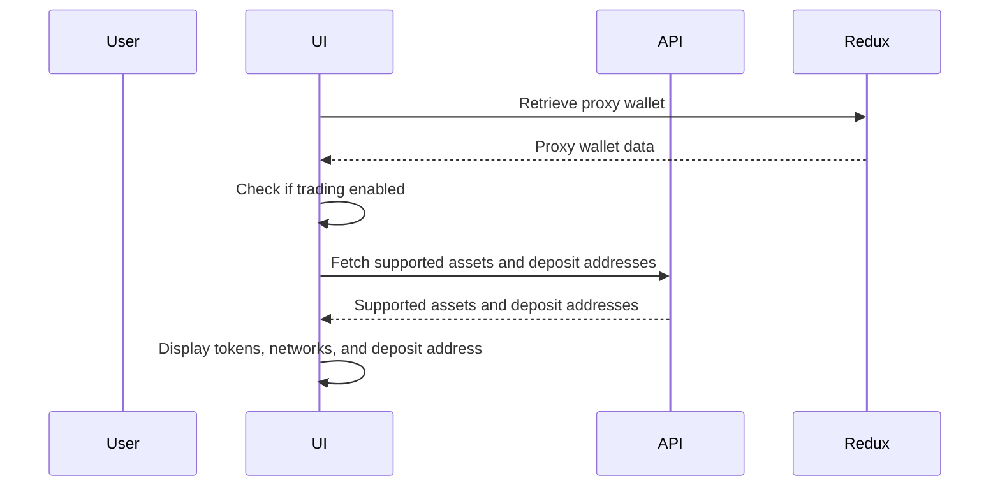

# Prediction Deposit Feature Specification
This document outlines the specifications for the Prediction Deposit feature in the KairoX Prediction platform. It covers the user story, goals, design references, business and technical rules, implementation solutions, data models, and definition of done for the feature. The goal is to enable users to deposit funds into their KairoX Prediction accounts seamlessly while adhering to the platform's requirements and standards.

## Context

### User Story

**As a** prediction market user,  
**I want to** deposit funds (cryptocurrencies) into my KairoX Prediction account,
**So that** I can participate in prediction markets and place order on various markets.

### Goal

- Enable users to deposit multiple cryptocurrencies from various blockchain networks into their KairoX Prediction wallet
- Provide a seamless and intuitive deposit experience with QR code scanning and address copying
- Support multi-chain deposits with automatic address generation per chain
- Display minimum deposit requirements and network-specific information

### Design Reference
- No Figma design available yet, but the UI should follow existing KairoX Prediction styles and patterns for consistency.

---

## Rules
### Business Rules
1. **Enable Trading Required**: User must enable trading (have a proxy wallet) before depositing
2. **Minimum Deposit**: Each token/chain combination has a minimum deposit amount
3. **Chain-specific Addresses**: Deposit addresses are generated per blockchain network
5. **Address Case Sensitivity**: 
   - Solana addresses: Case-sensitive (displayed as-is)
   - EVM addresses: Displayed in lowercase
6. **Default Token Selection**: USDC on Polygon network.

### Technical Rules
1. **Composition patterns**: Apply composition patterns for component design, by compound components, explicit component variants, lifting state up to provider,... Refer to agent skills which is installed in the project/global, written by Vercel.
2. **Data Fetching**: Use React Query for data fetching and caching
3. **State Management**: Use React state for local component state, and Redux for global state
---

## Implementation Solutions

### Architecture Overview

```
┌─────────────────────────────────────────────────────────────────────┐
│                         Container                                   │
│           (Desktop: Dialog / Mobile: Page)                          │
└─────────────────────────────┬───────────────────────────────────────┘
                              │
                              ▼
┌─────────────────────────────────────────────────────────────────────┐
│                         DepositForm                                 │
│  ┌─────────────────────────────────────────────────────────────┐    │
│  │                     State Management                        │    │
│  │  - selectedToken (string)                                   │    │
│  │  - selectedChainId (string)                                 │    │
│  └─────────────────────────────────────────────────────────────┘    │
│                               │                                     │
│     ┌─────────────────────────┼───────────────────┐                 │
│     │                         │                   │                 │
│     ▼                         ▼                   ▼                 │
│   ┌─────────────┐   ┌─────────────────┐   ┌─────────────────┐       │
│   │ SelectToken │   │  SelectNetwork  │   │   AddressQR     │       │
│   └─────────────┘   └─────────────────┘   └─────────────────┘       │
│                                                                     │
└─────────────────────────────────────────────────────────────────────┘
                              │
          ┌───────────────────┼───────────────────┐
          │                   │                   │
          ▼                   ▼                   ▼
┌─────────────────┐ ┌─────────────────┐ ┌─────────────────────────────┐
│ usePolymarket   │ │ usePolymarket   │ │     useProxyWallet          │
│ SupportedAssets │ │ UserDeposit     │ │ (Redux selector)            │
│ (React Query)   │ │ Addresses       │ │                             │
└────────┬────────┘ └────────┬────────┘ └──────────────┬──────────────┘
         │                   │                         │
         ▼                   ▼                         ▼
┌─────────────────────────────────────────────────────────────────────┐
│                     userService (GraphQL)                           │
│  - getPolymarketSupportedAssets()                                   │
│  - getPolymarketUserDepositAddresses()                              │
│  - getPolymarketProxyWallet()                                       │
└─────────────────────────────────────────────────────────────────────┘
                              │
                              ▼
┌─────────────────────────────────────────────────────────────────────┐
│                     xpUserClient (Apollo)                           │
│                     Backend GraphQL API                             │
└─────────────────────────────────────────────────────────────────────┘
```

### Sequence diagram



### Component Hierarchy

```
Container (responsive wrapper)
├── DepositForm
│   ├── AddressQR (QR code with logo)
│   ├── SelectToken (token dropdown)
│   ├── SelectNetwork (network dropdown)
│   └── Loading (loading state)
└── EnableTradingDialog (if no proxy wallet)
```

### Hooks
There are main hooks needed to be implemented to fetch data and manage state:

| Hook | Purpose | Data Source |
|------|---------|-------------|
| `usePolymarketSupportedAssets` | Fetch supported tokens/chains | React Query + GraphQL |
| `usePolymarketUserDepositAddresses` | Fetch user deposit addresses | React Query + GraphQL |
| `useProxyWallet` | Get current user's proxy wallet | Redux selector |

---

## Data Models
```typescript
SupportedAsset
PolymarketDepositAddress
```

---

## Definition of Done

### Functionality
- [ ] User can select token from supported list
- [ ] User can select network from available networks for selected token
- [ ] Deposit address is displayed correctly for selected chain
- [ ] QR code is generated with correct chain logo overlay
- [ ] Copy button copies deposit address to clipboard
- [ ] Minimum deposit amount is displayed
- [ ] Enable Trading flow works for new users
- [ ] Service unavailable state shows fallback UI with tutorial/bridge links

### UI/UX
- [ ] Loading spinner shown while fetching data
- [ ] All text is internationalized (EN, ZH, HK, VI,...)
- [ ] Proper error handling and fallback states

### Code Quality
- [ ] TypeScript strict mode compliance
- [ ] No ESLint errors/warnings
- [ ] Components follow existing project patterns
- [ ] Proper separation of concerns (hooks, services, components)
- [ ] React Query caching implemented correctly

### Testing
- [ ] Unit tests for utility functions
- [ ] Integration tests for DepositForm component
- [ ] E2E test for complete deposit flow
- [ ] Test responsive behavior (desktop/mobile)

### Documentation
- [ ] JSDoc comments for public functions
- [ ] README updated if needed

### Performance
- [ ] No unnecessary re-renders
- [ ] Images lazy loaded
- [ ] React Query cache strategy optimized
