# Luồng Xử Lý Dữ Liệu Claim Tiền Thưởng (Claim Winnings Data Flow)

Tài liệu này mô tả luồng dữ liệu thực tế trong `useClaimablePositions.ts` khi người dùng claim tiền thưởng, bao gồm lưu trữ trạng thái, cập nhật UI tạm thời và đồng bộ lại dữ liệu từ backend.

## Sơ Đồ Luồng Dữ Liệu (Data Flow Diagram)

```mermaid
sequenceDiagram
    participant UI as Giao Diện (UI)
    participant Hook as useClaimablePositions
    participant API as Backend API
    participant QueryCache as React Query Cache
    participant ReduxPending as Redux (predictionClaimedBalance)
    participant ReduxStatus as Redux (claimStatuses)

    UI->>Hook: Gọi claim()

    rect rgb(30, 30, 50)
        Note over Hook, API: Claim tuần tự từng vị thế
        Hook->>API: userService.claimPosition(conditionId, tokenId)
        API-->>Hook: Trả về TxHash hoặc lỗi
        Hook->>Hook: Cập nhật claimingStatuses/claimingErrors
    end

    alt Nếu có ít nhất 1 vị thế claim thành công
        Note over Hook, QueryCache: 1) Lấy số dư hiện tại làm mốc
        Hook->>QueryCache: getQueryData('usdc-balance', 'position-total')
        Note over Hook, ReduxPending: Lưu pending payout (kèm conditionId/tokenId) để UI hiển thị tạm thời
        Hook->>ReduxPending: addPendingPayout(wallet, amount, txHash, conditionId, tokenId, oldBalances)

        Note over Hook, Hook: 2) Tạm dừng refetch
        Hook->>Hook: setPauseRefetch(true)

        Note over Hook, QueryCache: 3) Invalidate lại dữ liệu sau 4s
        Hook->>QueryCache: invalidateQueries('claimablePositions', 'usdc-balance', 'users')
    end

    Hook-->>UI: Toast kết quả (success/partial/failed)

    %% Relayer polling
    Note over Hook: usePendingClaimPolling(proxyWallet)
    Hook->>API: getRelayerStatus(transactionHash) mỗi 3s\n(COMPLETED/FAILED thì dừng)
    alt COMPLETED
        Hook->>ReduxPending: removePendingClaim(transactionHash)
        Hook->>ReduxStatus: setClaimStatus(status='succeeded') cho toàn bộ batch keys
        Hook->>QueryCache: invalidateQueries('claimablePositions', 'usdc-balance', 'users')
    else FAILED
        Hook->>ReduxPending: removePendingClaim(transactionHash)
        Hook->>ReduxStatus: setClaimStatus(status='failed')
        Hook->>UI: toast lỗi từ relayer
    end
```

## Dữ Liệu Và Trạng Thái Trong Hook

### Truy vấn danh sách claimable
- **Nguồn**: `userService.getClaimablePositions()`.
- **Query key**: `['prediction', 'claimablePositions', proxyWallet]`.
- **Refetch**: mỗi 10s, bị tạm dừng khi `pauseRefetch = true` (sau khi claim).
- **Lưu ý**: `filteredData` KHÔNG lọc bỏ các vị thế đã claim trong Redux. UI luôn nhận đủ danh sách từ backend.

### Dữ liệu trả ra từ hook
- `marketsWon`: số lượng vị thế claimable (dựa vào backend).
- `proceeds`: tổng `currentValue` của các vị thế claimable.
- `totalReturn`: hiện đang trả về `0`.
- `images`: icon thị trường lấy từ `useMarketsByIds`.
- `raw`: toàn bộ dữ liệu claimable đã chuẩn hoá.
- `claim`, `isClaiming`: hàm claim và trạng thái mutation.
- `claimingStatuses`, `claimingErrors`, `resetClaimingStatuses`: trạng thái theo từng vị thế (key `conditionId:tokenId`).

## Dữ Liệu Được Lưu Sau Khi Claim Thành Công

### 1. Redux: `predictionClaimedBalance.slice.ts`
- **Lưu ở đâu**: `state.predictionBalance.pendingClaims`.
- **Dữ liệu**: `{ walletAddress, amount, transactionHash, conditionId, tokenId, oldUsdcBalance, oldTotalPositionValue }`.
- **Mục đích**: `useMyBalance` dùng pending claims để hiển thị số dư tạm thời. Công thức: USDC = `oldUsdcBalance + tổng amount pending`, Total Position Value = `oldTotalPositionValue - tổng amount pending`. Không dùng `setQueryData` để optimistic update; chỉ dùng pending claims để điều chỉnh số liệu hiển thị.

### 2. Polling relayer
- **Hook**: `usePendingClaimPolling(proxyWallet)`.
- **Logic**: poll `getRelayerStatus` mỗi 3s cho từng `transactionHash` pending. Khi COMPLETED → remove pending + invalidate queries. Khi FAILED → remove pending + toast lỗi.
  - Sau khi bỏ `claimedPositions`, cleanup dựa vào `claimStatuses` TTL 90s và refetch.

## Xử Lý Lỗi Khi Claim

- Mỗi vị thế được claim tuần tự. Nếu lỗi, hook cố gắng map `error.code` sang message đa ngôn ngữ qua IndexedDB (`errorMessages`).
- Nếu không map được, fallback về `error.message` hoặc `'Unknown error'`.
- Kết quả lỗi được lưu trong `claimingErrors` theo key `conditionId:tokenId` để UI hiển thị chi tiết.
